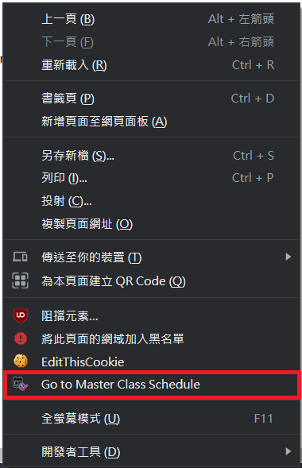

# CityU Timetable Checker

&copy; 2020-2021 Kelvin Lee. All rights reserved.

## Version 0.3.1 (Released on 27/08/2021)

**New functions:**

- Add a context menu (right-click menu) item that can jump to Master Class Schedule immediately.

- Adjusted auto-filling function. Sections which are full will not be auto-filled.

**Fixes:**

- No response when adding CRNs manually to the wishlist.

## Version 0.3.0 (Released on 30/12/2020)

**New functions:**

- As face-to-face teaching mode will be used more widely in Semester B 2020/21, the timetable view will now show the location where the lesson is conducted. Also, it will show the name of instructor of that section.
- Add warning when non-web-enabled sections exists in the wishlist, and exclude non-web-enabled sections from auto-fill function.

**Fixes:**

- Error occured when there are wishlist items which does not have status info (CRNs added manually in the popup window).

## Version 0.2.0 (Released on 31/08/2020)

**New functions:**

- Updated data structure of wishlist so that more information can be shown:
    - Course code and Section code*
    - Available seats / Waitlist remaining quota*
    - Conflicts*
    - Updated time
- Timetable view (on the popup and Timetable preview) are adjusted.
- Action cells split to 2, showing the two actions seperately.
- Changed page action to browser action so timetable can be accessed even not in AIMS. It also adds the ability to show the number of CRNs added to wishlist.

\* If the extension found a CRN matching with the wishlist when you browse the sections list of the Master Class Schedule, the information will be updated automatically.

**Fixes:**

- "Course registered" status may not be correctly shown if the section has more than one timeslots.

## Version 0.1.0 (Released on 29/08/2020)

This is the first release version of this extension.