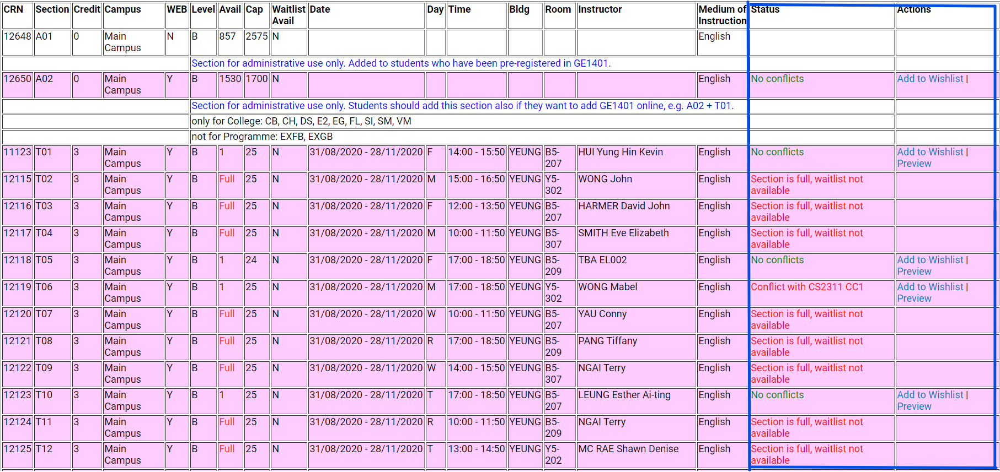

# CityU Timetable Checker

Timetable checker for CityU mates. It reads class information from AIMS and match against your timetable to see if time conflits with sessions occurs.

**This extension is for CityU students only, and only works when you are using [AIMS](https://banweb.cityu.edu.hk/).**

## Browser Support

This is a Chromium-based-browser extension that can be installed on the latest desktop versions of Google Chrome, Opera and Microsoft Edge. (Other Chromium-based browsers may be used, but we do not guarantee it works)

## How it works

This extension will read your class schedule when you go to Course Registration &gt; Main Menu for Web Add/Drop &gt; My Detail Schedule.

Then, when you browse the Master Class Schedule and check sections provided by a particular course, you can find out whether conflicts with the section and you current schedule occurs.

The extension will append 3 cells to each row of the table, showing the status and available actions. (Example below)

This extension also provides a wishlist function for you to save the CRNs of the courses you want to register. It can also auto-fill the CRNs in the wishlist to the Add Classes Worksheet in the add/drop interface. (You still need to click "Submit changes" button **manually** to apply changes)

## How to install

1. Download the ZIP archive under Releases or click "Download ZIP" in "Code" and unzip.
2. Go to the extension page of your browser (e.g. chrome://extensions/)
3. Turn on Developer Mode.
4. Click "Load unpacked".
5. Choose the unzipped folder. (e.g. if your zip archive is unzipped to `C:\Users\yourname\Documents`, then choose `C:\Users\yourname\Documents\timetable-checker-<version>`, while `<version>` is release version (such as `v0.1.0`) or `master`)
6. The extension is installed and listed in the extensions page.

## Status explaination

**Statuses will be displayed only if the section is web-enabled (rows in pink and with WEB = "Y"). If the section is not web-enabled, it always shows "Section not web-enabled".**

1. **No conflicts (green)**: The section does not conflict with your current schedule.
2. **Conflicts with \[Course Code\] \[Section\] (red)**: The section conflicts with your schedule.
3. **Section is full, waitlist available (orange)**: The section do not have available seat, but you can add to the waitlist of the section. Combined with statuses (1), (2) or (7).
4. **Section is full, waitlist full (red)**: The section do not have available seat, and the waitlist of the section is also full.
5. **Section is full, waitlist not available (red)**: The section do not have available seat, and waitlist is not provided of the section.
6. **Course registered (red)**: You have registered the course.
7. **Registrable (green)**: The section does not have a time information; it still have seats.

Note: If the status of a particular section is (4), (5) or (6), the option of adding the CRN into the wishlist will not be shown.